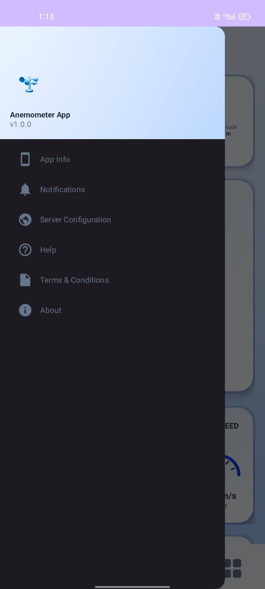
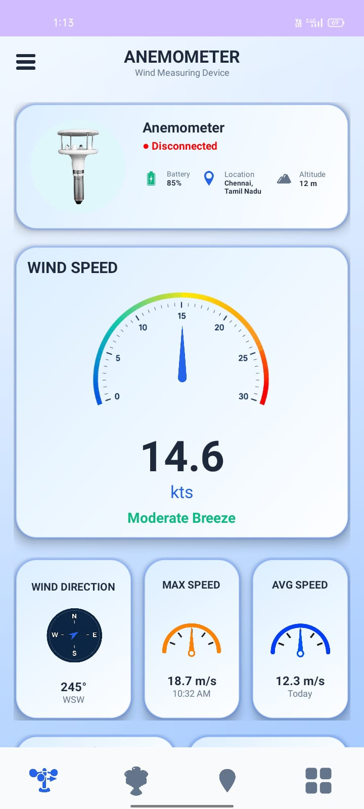
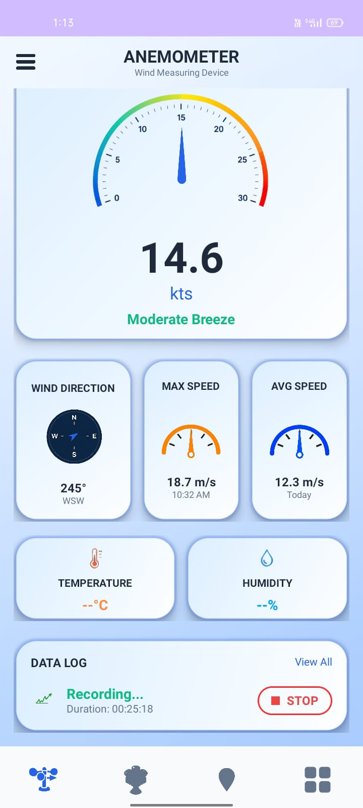
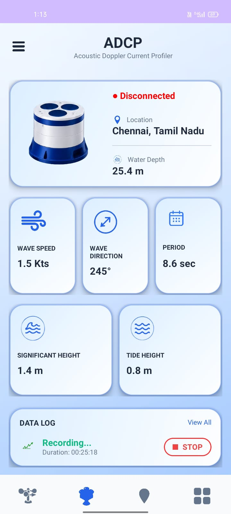
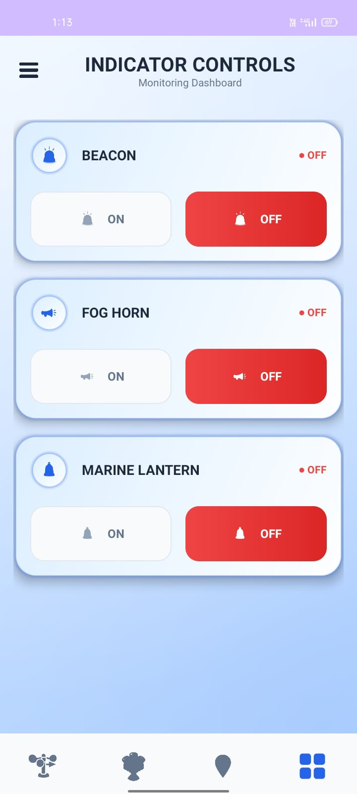

# 🌬️ Anemometer Android Application

## 📌 Project Overview
The Anemometer Android Application is a real-time wind monitoring application developed using Android Studio. It displays live environmental data such as wind speed, wind direction, GPS location, temperature, humidity, and load pin amplifier values. The application is designed with a modern and user-friendly interface for efficient monitoring.

---

## ✨ Features

- 🌪️ Real-time Wind Speed Monitoring
- 🧭 Wind Direction Compass
- 📍 GPS Location Tracking
- 🌡️ Temperature Monitoring
- 💧 Humidity Monitoring
- ⚡ Load Pin Amplifier Monitoring
- 📱 Professional Android UI
- 🔄 Real-time Data Simulation using Flask Server

---

## 🛠️ Technologies Used

- Java
- Android Studio
- XML
- Flask (Python)
- REST API
- JSON
- Git & GitHub

---

## 📱 Application Modules

- Dashboard
- Anemometer
- GPS & LPA
- Status
- Settings

---

## 🚀 How to Run

1. Clone the repository
2. Open the project in Android Studio
3. Sync Gradle
4. Run the Flask Server
5. Connect the Android application
6. Launch the app on an emulator or Android device

---

## 📂 Project Structure

```
app/
gradle/
res/
java/
AndroidManifest.xml
build.gradle
settings.gradle
```

---

## 📷 Screenshots


### Dashboard


### Anemometer



### ADCP


### GPS


### Status


---

## 🎯 Future Enhancements

- Bluetooth Sensor Integration
- Cloud Data Storage
- Graphical Data Analysis
- Historical Data Reports
- User Authentication
- IoT Device Connectivity

---

## 👨‍💻 Developed By

**S. Ilakiya**

Final Year B.E. Computer Science and Engineering

---
